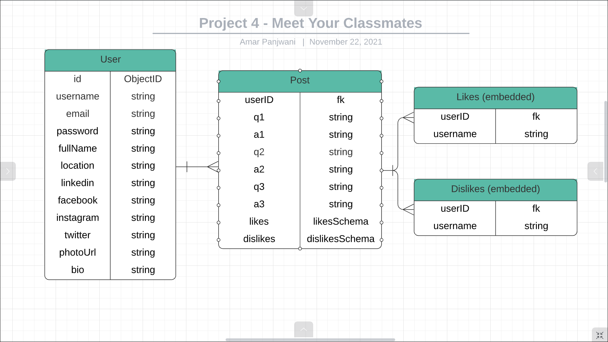
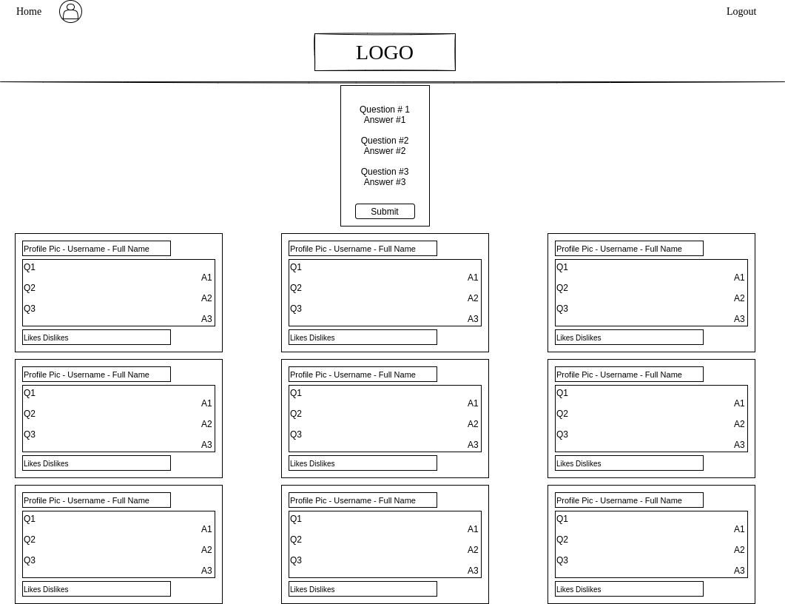
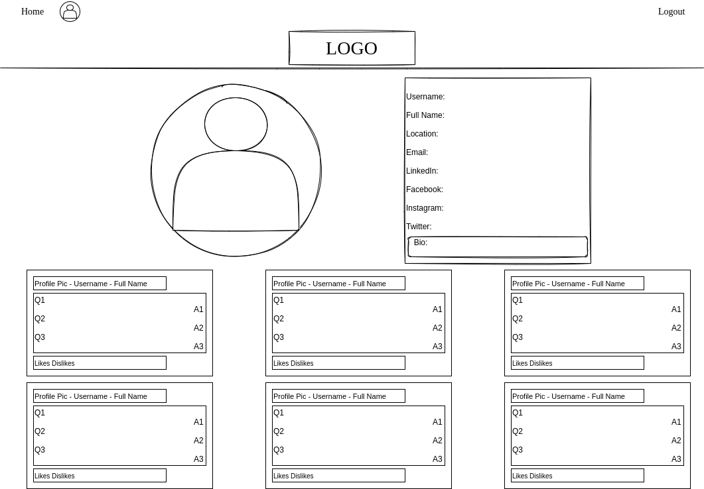
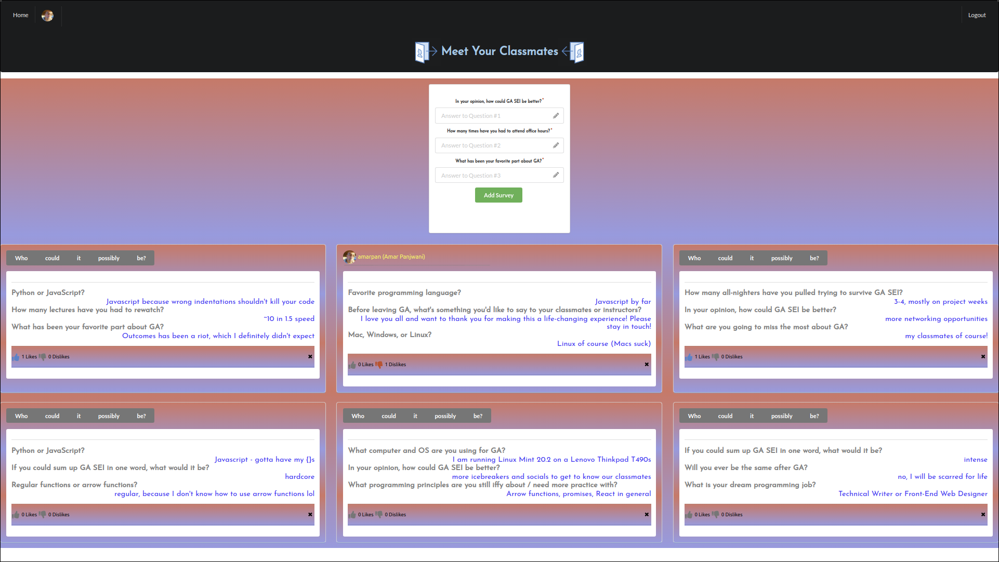
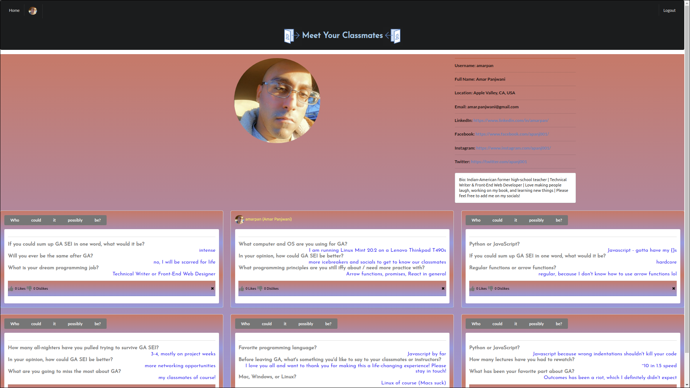

 
# MEET YOUR CLASSMATES
**Created by [Amar Pan](https://www.linkedin.com/in/profpan396/)**
#### [CLICK TO DEMO](https://meetyourclassmates.herokuapp.com) 

 
   
  
   
  
  
  
   
  
  

## 📝 Description
Meet Your Classmates is a hub where students can get to know their peers via completion of short 3-question mini-surveys. By learning about others' backgrounds, previous experiences, and interests, an atmosphere of community is created that is conducive to higher levels of learning and success. 

## :camera_flash: Screenshots

<!-- 

 
 📊 ERD

 
 | Description | Screenshot |
 |------------ | ------------|
 | <h3 align="center">ERD</h3> | 
 

 -->

<!-- 

 
 🎨 Wireframes

 
 | Description | Screenshot |
 |------------ | ------------|
 | <h3 align="center">Home Page</h3> | 
 | <h3 align="center">Profile Page</h3> | 
 
 

 -->
 
 | Description | Screenshot |
 |------------ | ------------|
 | <h3 align="center">Feed Page</h3> | 
 | <h3 align="center">Profile Page</h3> | 
 

 

 
## 💻 Technologies Used
 

 

 

 

## 🔥 Getting Started

How to Create a Post

 
1. Type in your answers to each of the 3 randomly-generated mini-survey questions. 
 
2. Click on "Add Survey" to post your responses so others may see them.
 
3. Click on the "X" in the bottom-right corner to delete a post. 

How to Interact With Others' Posts

 
:one:  Posts may be "liked" or "disliked" by clicking on the thumbs up or down button on their card.
 
:two: To reveal the author of a post, hover over the "Who could it possibly be?" button.
 
:three: To see more posts by the same user, click on the revealed username and profile picture.

Trello Board

<a href="https://trello.com/b/x4ViComX/meet-your-classmates-project-4">https://trello.com/b/x4ViComX/meet-your-classmates-project-4</a>

Deployed Link (Heroku)

<a href="https://meetyourclassmates.herokuapp.com/">https://meetyourclassmates.herokuapp.com/</a>

<!-- #### [Pitch-Deck](https://docs.google.com/presentation/d/1h2wwLEPFEW8QYUVp-uX2hn5afxvE5GVZatkmLsMW-J4/edit?usp=sharing)

#### [Heroku Deployment](https://gatracker.herokuapp.com/) -->

## ⏭️ Next Steps
### Upcoming Features
- [:star:] Add gifs to animated sliding buttons
- [:x:] Add comment functionality on posts to encourage discussion
- [:x:] Add edit and update functionality for a user's profile

